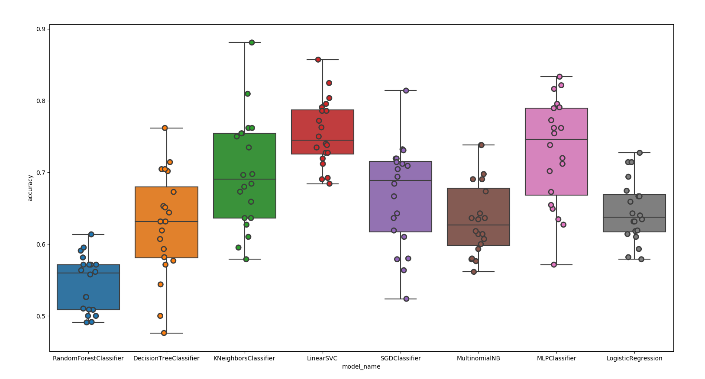
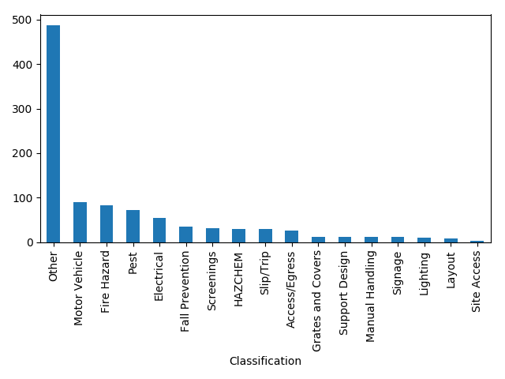
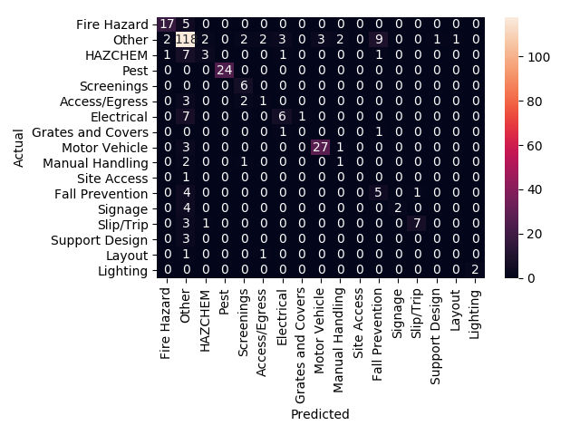
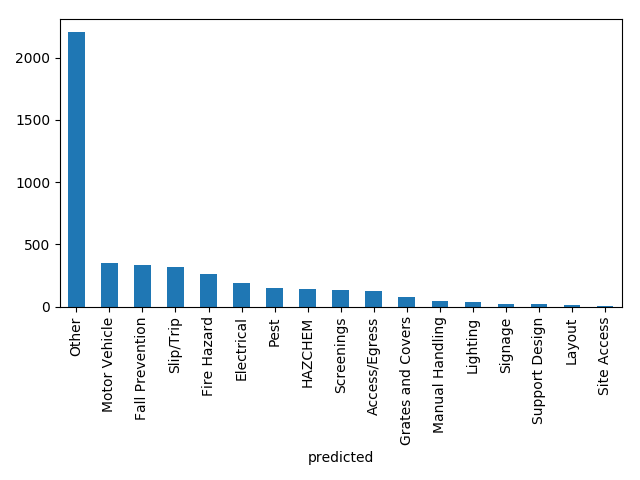

# Incident Report Classification
This repo utilises machine learning models to 
- Determine if an incident is design-related
- Determine the category of incident if design-related (e.g. automotive, access/egress)

## Analysis of Classifiers
LinearSVC is used as it showed the highest accuracies


## Imbalanced Data
The distribution of incidents across categories in the labelled dataset is highly skewed towards the 'Other' category. 

RandomOverSampler from imblearn is used as synthetic samplers such as SMOTE/ADASYN required a minimum number of classified incidents per category which was not reached. RandomOverSampler simply chooses samples from each category to duplicate. An accuracy increase of ~2-5% was observed.

## Results Analysis
### Confusion Matrix

The confusion matrix shows the tendency for other incident categories to be classified into the 'Other' category. This is a result of the initial data distribution and can be improved upon by using synthetic oversampling in the future.
### Incorrect Cases

There exist cases where to humans, the predicted category is obviously incorrect. This needs to be improved in the future.
However, there are also cases where the initial labels were incorrect.

## Results
### Design Classifier

### Category Classifier


## Usage
```
pip install -r requirements.txt
python design_classifier.py 
python category_classifier.py
```

Note incidents.csv is required. 


