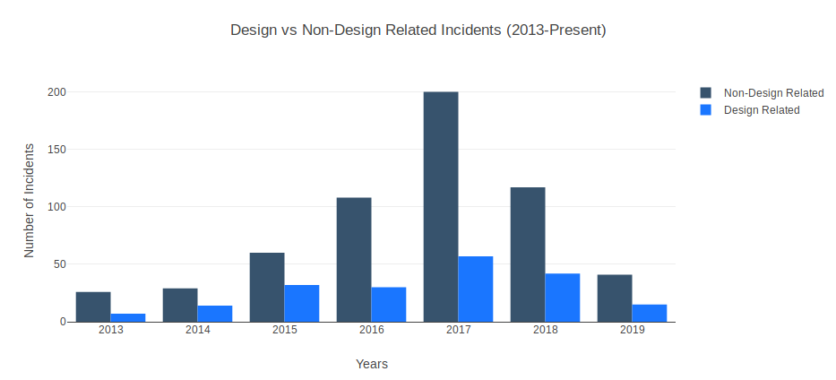

# Incident Report Classification
This repo utilises machine learning models to 
- Determine if an incident is design-related
- Determine the category of incident if design-related (e.g. automotive, low-ceiling)

## Results


## Usage
```
pip install -r requirements.txt
python design_classifier.py 
python category_classifier.py
```

Note incidents.csv is needed.


